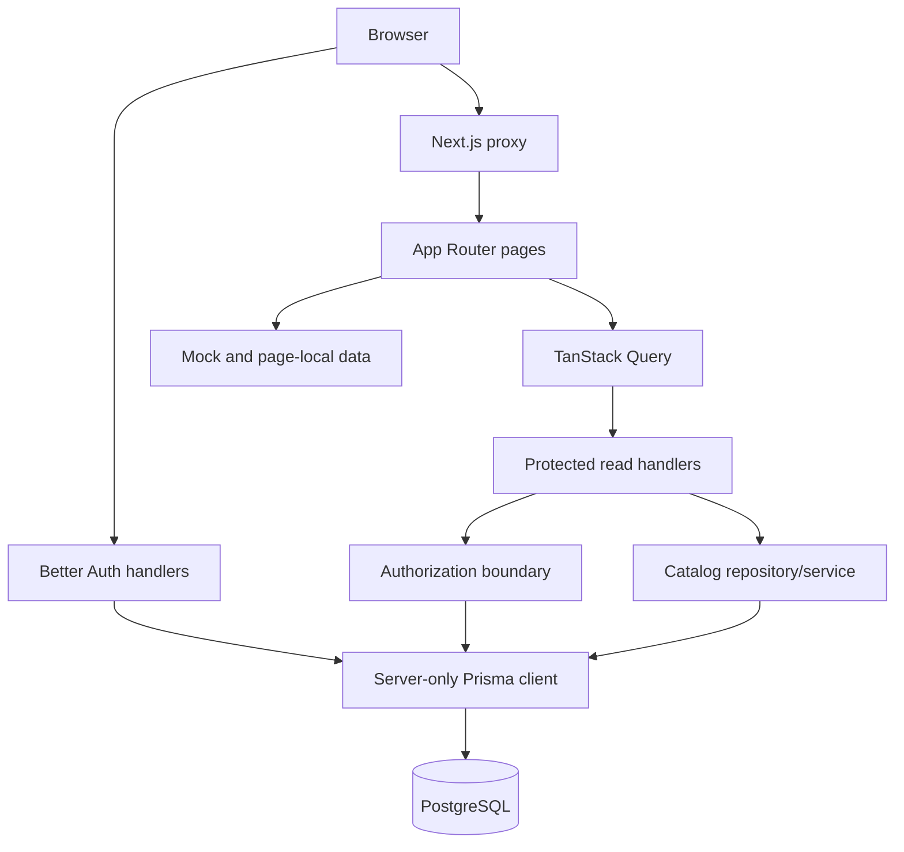

<!-- generated-by: gsd-doc-writer -->
# Architecture

## System overview

Chezcar Sales & Inventory is a Next.js 16 App Router modular monolith. It is still primarily a UI prototype with a growing production-oriented foundation: database-backed authentication (plus a guarded internal credential engine), action-capability and multi-location authorization from pages through APIs, delegated user and role management with immediate session revocation, a first-login credential prompt, capability-aware shell navigation, scoped Product/Inventory reads, durable Stock Room transfers and supplier receipts, persistent per-user workflow notifications, deterministic catalog onboarding tooling, and a disposable-database test harness.

Most sales/customer/order screens, stock-card history, reports, and offline workflows remain page-local or fixture-backed. Their presence in the UI is not evidence of persistence unless documented here or in `docs/API.md`.

## Active boundaries

## Implemented foundation

| Area | Current behavior | Key files |
| --- | --- | --- |
| Authentication | Better Auth email/password sessions; public sign-up disabled; generic admin operations unroutable | `lib/server/auth.ts`, `app/api/auth/[...all]/route.ts` |
| Idle session logout | Authenticated shell signs out after 10 minutes without keyboard, pointer, touch, scroll, or visible-tab activity; timestamps synchronize across same-origin tabs | `components/idle-session-logout.tsx`, `lib/idle-session.ts` |
| Internal credentials | Server-only unmounted Better Auth Admin-plugin engine exposing only guarded staff `createUser`/`setUserPassword` primitives | `lib/server/internal-user-auth.ts` |
| Page protection | Proxy validates sessions, reloads persisted capabilities and UserLocation assignments, maps the first path segment to a named capability, and redirects unauthenticated requests to `/sign-in` or forbidden requests to `/access-denied` | `proxy.ts`, `app/access-denied/page.tsx` |
| Authorization | Reloaded action capabilities plus explicit `isOwner` and UserLocation assignments; owner/`locations:all` reaches every active location, restricted empty assignments fail closed | `lib/contracts/roles.ts`, `lib/server/policy/access.ts`, `lib/server/authorization.ts` |
| Persistence | One server-only Prisma singleton and additive migration history for implemented auth, catalog, inventory, sales, and workflow models | `lib/server/prisma.ts`, `prisma/migrations/` |
| Products | Validated paginated Prisma list/maintenance plus private authenticated product-image storage; add/edit/delete/image actions are independently capability-gated | `app/api/products/`, `lib/server/catalog.ts`, `lib/server/services/product-images.ts`, `app/products/page.tsx` |
| Inventory | Product-first list pagination plus live availability reads; persisted active-location scope enforced at the APIs and mirrored by role-clamped client controls | `app/api/inventory/`, `lib/server/catalog.ts`, `lib/server/inventory-availability.ts`, `app/inventory/`, `components/location-scope-control.tsx` |
| Customers | Database-backed customer CRUD and persisted sales/order history; customer records are shared by POS and Customer Orders | `app/api/customers/`, `lib/server/services/customer-sales.ts`, `app/customers/` |
| Customer orders and POS options | Accessible branches load before selection; selected-branch products require explicit location access, and the shared endpoint independently accepts `customer-orders:create` or `sales:post` | `app/api/customer-orders/options/route.ts`, `lib/server/services/customer-sales.ts`, `app/customer-orders/`, `app/pos/` |
| Receipt verification | POS captures private handwritten-receipt evidence after posting; local Tesseract OCR stores a non-authoritative comparison draft; Accounting sees system input beside the OCR draft and original image; pending uploads notify Branch Staff and verification remains blocked without evidence | `app/api/accounting/receipts/`, `lib/server/services/receipt-ocr.ts`, `lib/server/services/receipt-evidence-notifications.ts`, `lib/server/services/customer-sales.ts`, `app/pos/page.tsx`, `app/accounting/receipt-verification/` |
| Provisioning | Environment-driven owner Admin plus deterministic six-location canonical catalog seed/reload behind positive disposable-target gates | `prisma/seed.mjs`, `lib/server/services/catalog-reset.ts`, `.env.example` |
| Data onboarding tooling | Read-only workbook profiler, fail-closed canonicalizer with keyed owner resolutions, and byte-stable fixture generator — developer CLIs only, no HTTP/UI surface | `scripts/data-onboarding/`, `prisma/fixtures/opening-catalog.json` |
| User management | Capability-delegated, location-constrained lifecycle with actor-scoped filters/options, grant ceilings, self-management refusal, transactional session revocation, and safe DTOs | `app/api/users/`, `lib/server/services/users.ts`, `app/users/` |
| Role maintenance | Action-only roles with delegated grant ceilings, self-role refusal, assigned counts, optimistic versions, assignment serialization, and grant-change session revocation | `app/api/roles/`, `lib/server/services/roles.ts`, `app/users/roles/` |
| Branch maintenance | Capability-delegated, location-constrained active-branch workflow | `lib/server/services/branches.ts`, `app/api/branches/`, `app/branches/` |
| Stock transfers | Durable SR-to-branch transfer lifecycle with Admin operational cover for Stock Staff actions, discrepancy investigation/resolution, inventory movements, audit view, and persisted workflow notifications | `app/api/stock-transfers/`, `lib/server/services/stock-transfers.ts`, `app/stock-transfers/` |
| Stock receipts | Durable Stock Room supplier receipts that increment SR balances and write inventory movements | `app/api/stock-receipts/route.ts`, `app/inventory/receive/`, `lib/server/services/stock-receipts.ts` |
| Notifications | Per-user persisted inbox rows with cursor replay, SSE wake-ups, browser push attempts, and read timestamps; escalation deferred | `app/api/notifications/`, `lib/server/services/notifications.ts`, `lib/server/services/push-notifications.ts`, `app/notifications/page.tsx` |
| Offline branch sales | Server, IndexedDB, and sync foundation retained, but the POS queue/banner and Admin navigation are temporarily disabled pending a simpler operating workflow; transfer offline evidence remains deferred | `app/api/offline/`, `lib/server/services/offline-sales.ts`, `lib/offline-sales-client.ts`, `app/pos/page.tsx` |
| First-login credential prompt | Authenticated GET/POST `/api/credential-setup` state machine consumed exactly once per arming; blocking dialog after sign-in | `app/api/credential-setup/route.ts`, `components/credential-setup-dialog.tsx` |
| Access-aware shell | Server-derived serializable access DTO hydrates a focused client context; sidebar renders only permitted entries without forbidden-link flash | `lib/server/shell.ts`, `components/app-layout-shell-client.tsx`, `components/shell-access-context.tsx` |
| Test harness | Vitest Node unit project plus serial integration project over a fixed-identity disposable PostgreSQL 17 lifecycle | `vitest.config.ts`, `tests/helpers/database.ts`, `tests/helpers/factories.ts`, `tests/helpers/requests.ts` |

## Data flow

### Authentication

1. The browser posts email/password to Better Auth's same-origin handler.
2. Better Auth verifies the credential Account and writes a database Session.
3. The browser receives a secure session cookie according to Better Auth environment defaults.
4. `proxy.ts` resolves the session, reloads the persisted User plus RoleDefinition and UserLocation rows, and maps the path to a named capability before serving page routes.
5. Protected APIs validate the session again, reload the persisted User, require `ACTIVE` status, and enforce the same capability policy.

A session identifies a user but does not independently authorize a resource.

### Page denial

1. A missing, expired, inactive, or revoked page session redirects to `/sign-in` with a validated local callback (protocol-relative callbacks are rejected).
2. An authenticated request whose persisted assignment lacks the page capability redirects to the fixed `/access-denied` URL with no query, record, filter, or retry values.
3. `/access-denied` is a prop-free static server component, so no protected request context can reach the rendered denial UI; its only in-screen CTA returns to `/dashboard`.

### User management and credentials

1. `/users` gates on `users:view`; each operation, filter, summary, and form option is constrained by effective location and capability reach.
2. Create/update/status/password mutations run in application services owning Prisma transactions. Delegated lifecycle mutations lock and re-read the target user with `FOR UPDATE`, share-lock the current role, and require the target's current effective capabilities and complete effective location set to fit within the actor's authority; access changes delete all target sessions in the same transaction.
3. Role dropdowns use persisted `roleId`; user writes replace authoritative UserLocation rows atomically, and delegated managers cannot assign beyond their own effective grants, manage a target whose complete effective location set exceeds theirs, or self-manage access.
4. Delegated role edits require both the role's current and requested permissions to remain within the actor's effective capability ceiling.
5. Staff credentials are created and reset only through the guarded internal Better Auth primitives (`lib/server/internal-user-auth.ts`); the public auth catch-all keeps an Admin-plugin-free instance, so generic admin operations are structurally unroutable.
6. After sign-in with an armed `credentialSetupRequired`, a blocking dialog offers change or skip; either consumes the prompt exactly once per arming, and a later Admin reset re-arms it.

### Products

1. `/products` retains applied filter state and a complete TanStack Query key.
2. The browser calls `GET /api/products` with validated pagination/filter parameters.
3. The route requires `products:view`; create, update, delete, and image mutations independently require their matching capabilities.
4. `lib/server/catalog.ts` queries Product and balance reorder information through Prisma.
5. Decimal values are explicitly serialized for the existing UI DTO.

### Inventory

1. `/inventory` calls `GET /api/inventory` through TanStack Query.
2. The API permits Admin, Stock Staff, and Branch Staff.
3. Location scope comes from active UserLocation rows; request filters cannot widen it.
4. The server filters and paginates Products first, then returns all matching balances for those products.
5. Availability and stock status are derived, not trusted from client input.
6. The Inventory Availability sheet independently queries all matching balances and receives dynamic filter options within the same active-location scope.

The stock card sheet still includes prototype option data; Inventory Availability is database-backed and read-only.

## App Router composition

- `app/layout.tsx` remains the server root and composes `Providers` with `AppLayoutShell`.
- `AppLayoutShell` loads the persisted access on the server, serializes a browser-safe DTO into one client context (`components/shell-access-context.tsx`), and never renders a full client menu while access loads.
- The sidebar renders only capability-permitted entries; prototype routes without a named central capability stay out of authenticated navigation. `/sign-in` omits the sidebar and `/pos` keeps its full-width exception.
- Business pages predating the server foundation remain client-heavy; newer surfaces (`/users`, `/inventory`) authorize on the server and hydrate focused clients with serializable DTOs only.
- New routes should remain server components by default and delegate only interactive islands to clients.
- `proxy.ts` protects page navigation; every sensitive API must still perform its own authorization.

## Database shape

The committed schema intentionally includes only models implemented by this slice:

- Location (`WAREHOUSE` or `BRANCH`)
- Product (nullable price for inactive, non-sellable opening products)
- InventoryBalance
- StockTransfer, transfer lines, discrepancy, investigation, resolution, and InventoryMovement
- StockReceipt and receipt lines
- Notification with per-user read state
- RoleDefinition with action grants, explicit singleton `isOwner`, optimistic version, and assigned Users
- User with required accessRole, `ACTIVE`/`INACTIVE` status, many UserLocation assignments, and compatibility role/location columns
- Better Auth Session (with plugin-compatible `impersonatedBy`), Account, and Verification

The explicit-location authorization migration backfills UserLocation assignments, removes the obsolete role/location nullability CHECK, and adds singleton owner-role and owner-user indexes. Better Auth compatibility fields remain inert (`User.status` remains the sole activation authority).

Unimplemented draft order, sale, job, payment, and general adjustment models are kept out of migration history until their canonical workflow is built. See `docs/product/PROVISIONAL-DATA-MODEL.md`.

## Security properties

- Public sign-up is disabled and refused before any database mutation; generic Better Auth admin operations return 404 through the unchanged public catch-all, proven by regression tests.
- The Better Auth Admin plugin exists only inside the server-only unmounted `internalUserAuth` facade; second-owner creation is blocked by service guards and singleton database indexes.
- Seed credentials come only from environment variables and are hashed before storage.
- Prisma and both Better Auth instances stay in server-only modules.
- Product, inventory, and user query parameters are validated with Zod.
- Effective locations are owner/`locations:all` or explicit active UserLocation IDs; incompatible caller targets cannot widen them.
- Non-owner authorization reads persisted grants on every request. Owner gets the complete compile-time catalog; grant changes revoke assigned sessions transactionally.
- Page routing is fail-closed at the proxy with a central page-capability map; denial surfaces stay data-free by construction (fixed URL at the proxy, prop-free fixed copy at the page).
- Inactive users and users without an allowed capability are denied by application APIs before query parsing or protected work.
- Deactivation or role/location changes revoke all target sessions in the same transaction as the access write; injected-failure tests prove atomic rollback.
- Existing mock route handlers require active sessions and now enforce named capabilities.

## Known risks

1. Job orders, stock cards, and parts of the offline workflow remain non-durable prototypes.
2. GitHub Actions runs the automated Vitest unit/integration suites and deployment-image build, then publishes successful `main` images to GHCR for manual Coolify deployment; coverage tooling is absent.
3. The local Compose bind mount can contain machine-specific/corrupt PostgreSQL state; use logical backups and the disposable test target for migration verification.
4. Product price is a current Decimal serialized as a number for legacy UI compatibility; canonical price history and money transport are unresolved.
5. Inventory movements cover transfers, supplier receipts, sales, releases, and manual adjustments; damaged/return locations and stock cards remain incomplete.
6. Sidebar visibility is capability-aware for implemented pages, but visibility remains presentation feedback only; server endpoints are the security boundary.
7. Remaining Job Order and supporting page-local fixtures still disagree with canonical records.
8. No rate limiting, password-reset delivery channel, startup environment validation, or monitoring exists; deployment is documented but backup/restore remains operator-controlled and unverified.
9. Lint passes with existing warnings; unit/integration tests, type-check, and build also pass locally.
10. Existing Recharts components emit zero-size warnings during prerender.

## Next direction

1. Extend deterministic route and database integration tests to each new durable workflow as it lands.
2. Keep navigation and page affordances reflecting persisted role/location scope without treating visibility as authorization.
3. Define the inventory movement ledger and product import contract before any stock mutation.
4. Implement one transactional workflow at a time behind validated, authorized application services.
5. Add realtime notification delivery and offline behavior only after online transaction invariants are proven.
6. Add CI and coverage only after local commands remain reliable across environments.
