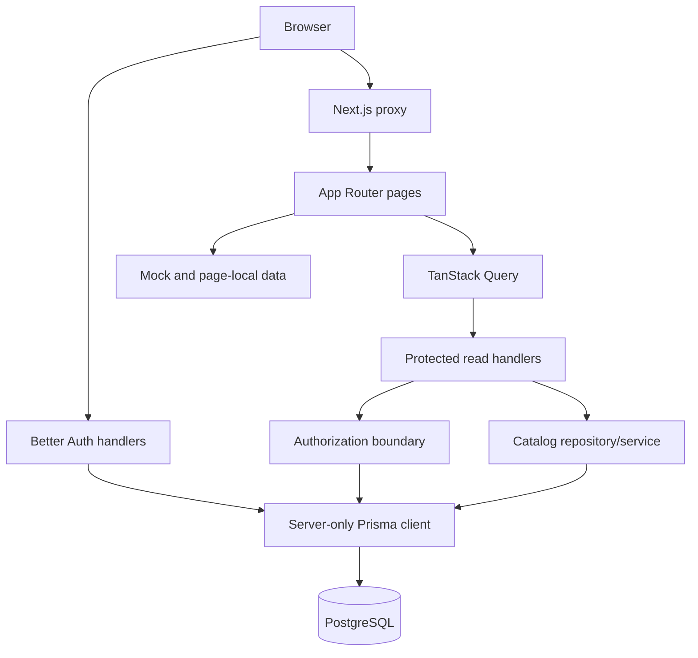

<!-- generated-by: gsd-doc-writer -->
# Architecture

## System overview

Chezcar Sales & Inventory is a Next.js 16 App Router modular monolith. It is still primarily a UI prototype with a growing production-oriented foundation: database-backed authentication (plus a guarded internal credential engine), fixed role/location authorization from pages through APIs, owner-Admin user management with immediate session revocation, a first-login credential prompt, capability-aware shell navigation, scoped Product/Inventory reads, durable Stock Room transfers and supplier receipts, persistent per-user workflow notifications, deterministic catalog onboarding tooling, and a disposable-database test harness.

Most sales/customer/order screens, stock-card history, availability inquiry, reports, and offline workflows remain page-local or fixture-backed. Their presence in the UI is not evidence of persistence unless documented here or in `docs/API.md`.

## Active boundaries

## Implemented foundation

| Area | Current behavior | Key files |
| --- | --- | --- |
| Authentication | Better Auth email/password sessions; public sign-up disabled; generic admin operations unroutable | `lib/server/auth.ts`, `app/api/auth/[...all]/route.ts` |
| Internal credentials | Server-only unmounted Better Auth Admin-plugin engine exposing only guarded staff `createUser`/`setUserPassword` primitives | `lib/server/internal-user-auth.ts` |
| Page protection | Proxy validates sessions, reloads the persisted User/Location, maps the first path segment to a named capability, and redirects unauthenticated requests to `/sign-in` or forbidden requests to `/access-denied` | `proxy.ts`, `app/access-denied/page.tsx` |
| Authorization | Named fixed-role capability matrix evaluated against reloaded active User plus Location; fails closed on any inconsistent assignment | `lib/server/policy/access.ts`, `lib/server/authorization.ts` |
| Persistence | One server-only Prisma singleton, one initial migration, and one additive trusted-foundation migration with role-scope and singleton-Admin constraints | `lib/server/prisma.ts`, `prisma/migrations/` |
| Products | Validated, paginated Prisma read for `products:view` holders (Admin, Stock Staff) | `app/api/products/route.ts`, `lib/server/catalog.ts`, `app/products/page.tsx` |
| Inventory | Product-first pagination with complete matching balances; persisted scope enforced at the API and mirrored by role-clamped client controls | `app/api/inventory/route.ts`, `lib/server/catalog.ts`, `app/inventory/page.tsx`, `components/location-scope-control.tsx` |
| Customers | Database-backed customer CRUD and persisted sales/order history; customer records are shared by POS and Customer Orders | `app/api/customers/`, `lib/server/services/customer-sales.ts`, `app/customers/` |
| Customer orders | Database-backed reservations with Admin branch selection and branch-aware available-stock options | `app/api/customer-orders/`, `lib/server/services/customer-sales.ts`, `app/customer-orders/` |
| Provisioning | Environment-driven owner Admin plus deterministic six-location canonical catalog seed/reload behind positive disposable-target gates | `prisma/seed.mjs`, `lib/server/services/catalog-reset.ts`, `.env.example` |
| Data onboarding tooling | Read-only workbook profiler, fail-closed canonicalizer with keyed owner resolutions, and byte-stable fixture generator — developer CLIs only, no HTTP/UI surface | `scripts/data-onboarding/`, `prisma/fixtures/opening-catalog.json` |
| User management | Owner-Admin-only `/api/users` lifecycle (list/create/update/status/password) with transactional session revocation and safe DTOs | `app/api/users/`, `lib/server/services/users.ts`, `app/users/` |
| Stock transfers | Durable SR-to-branch transfer lifecycle with discrepancy investigation, Admin/Stock Staff resolution, inventory movements, audit view, and persisted workflow notifications | `app/api/stock-transfers/`, `lib/server/services/stock-transfers.ts`, `app/stock-transfers/` |
| Stock receipts | Durable Stock Room supplier receipts that increment SR balances and write inventory movements | `app/api/stock-receipts/route.ts`, `app/inventory/receive/`, `lib/server/services/stock-receipts.ts` |
| Notifications | Per-user persisted inbox rows with transfer links and read timestamps; realtime/push/escalation deferred | `app/api/notifications/`, `lib/server/services/notifications.ts`, `app/notifications/page.tsx` |
| First-login credential prompt | Authenticated GET/POST `/api/credential-setup` state machine consumed exactly once per arming; blocking dialog after sign-in | `app/api/credential-setup/route.ts`, `components/credential-setup-dialog.tsx` |
| Access-aware shell | Server-derived serializable access DTO hydrates a focused client context; sidebar renders only permitted entries without forbidden-link flash | `lib/server/shell.ts`, `components/app-layout-shell-client.tsx`, `components/shell-access-context.tsx` |
| Test harness | Vitest Node unit project plus serial integration project over a fixed-identity disposable PostgreSQL 17 lifecycle | `vitest.config.ts`, `tests/helpers/database.ts`, `tests/helpers/factories.ts`, `tests/helpers/requests.ts` |

## Data flow

### Authentication

1. The browser posts email/password to Better Auth's same-origin handler.
2. Better Auth verifies the credential Account and writes a database Session.
3. The browser receives a secure session cookie according to Better Auth environment defaults.
4. `proxy.ts` resolves the session, reloads the persisted User plus Location, and maps the first path segment to a named capability before serving page routes.
5. Protected APIs validate the session again, reload the persisted User, require `ACTIVE` status, and enforce the same capability policy.

A session identifies a user but does not independently authorize a resource.

### Page denial

1. A missing, expired, inactive, or revoked page session redirects to `/sign-in` with a validated local callback (protocol-relative callbacks are rejected).
2. An authenticated request whose persisted assignment lacks the page capability redirects to the fixed `/access-denied` URL with no query, record, filter, or retry values.
3. `/access-denied` is a prop-free static server component, so no protected request context can reach the rendered denial UI; its only in-screen CTA returns to `/dashboard`.

### User management and credentials

1. The owner Admin's `/users` server page gates on `users:manage`, then hydrates a focused client component over the durable `/api/users` surface.
2. Create/update/status/password mutations run in application services owning Prisma transactions with `FOR UPDATE` row locking; access changes delete all target sessions in the same transaction.
3. Staff credentials are created and reset only through the guarded internal Better Auth primitives (`lib/server/internal-user-auth.ts`); the public auth catch-all keeps an Admin-plugin-free instance, so generic admin operations are structurally unroutable.
4. After sign-in with an armed `credentialSetupRequired`, a blocking dialog offers change or skip; either consumes the prompt exactly once per arming, and a later Admin reset re-arms it.

### Products

1. `/products` retains applied filter state and a complete TanStack Query key.
2. The browser calls `GET /api/products` with validated pagination/filter parameters.
3. The route permits only Admin or Stock Staff.
4. `lib/server/catalog.ts` queries Product and balance reorder information through Prisma.
5. Decimal values are explicitly serialized for the existing UI DTO.

### Inventory

1. `/inventory` calls `GET /api/inventory` through TanStack Query.
2. The API permits Admin, Stock Staff, and Branch Staff.
3. Branch Staff scope comes from persisted `User.locationId`; request filters cannot widen it.
4. The server filters and paginates Products first, then returns all matching balances for those products.
5. Availability and stock status are derived, not trusted from client input.

Stock card and availability sheets still use local fixtures and must not be described as database-backed.

## App Router composition

- `app/layout.tsx` remains the server root and composes `Providers` with `AppLayoutShell`.
- `AppLayoutShell` loads the persisted access on the server, serializes a browser-safe DTO into one client context (`components/shell-access-context.tsx`), and never renders a full client menu while access loads.
- The sidebar renders only capability-permitted entries; prototype routes without a named central capability stay out of authenticated navigation. `/sign-in` omits the sidebar and `/pos` keeps its full-width exception.
- Business pages predating the server foundation remain client-heavy; newer surfaces (`/users`, `/inventory`) authorize on the server and hydrate focused clients with serializable DTOs only.
- New routes should remain server components by default and delegate only interactive islands to clients.
- `proxy.ts` protects page navigation; every sensitive API must still perform its own authorization.

## Database shape

The committed schema intentionally includes only models implemented by this slice:

- Location (`WAREHOUSE` or `BRANCH`)
- Product (nullable price for inactive, non-sellable opening products)
- InventoryBalance
- StockTransfer, transfer lines, discrepancy, investigation, resolution, and InventoryMovement
- StockReceipt and receipt lines
- Notification with per-user read state
- User with four fixed roles, `ACTIVE`/`INACTIVE` status, optional Location assignment, and `credentialSetupRequired`
- Better Auth Session (with plugin-compatible `impersonatedBy`), Account, and Verification

The additive trusted-foundation migration enforces the role/location nullability matrix with a CHECK constraint, backs the singleton owner Admin with a partial unique index, and adds Better Auth 1.6.23 Admin-plugin compatibility fields that lifecycle services keep inert (`User.status` remains the sole activation authority).

Unimplemented draft order, sale, job, payment, and general adjustment models are kept out of migration history until their canonical workflow is built. See `docs/product/PROVISIONAL-DATA-MODEL.md`.

## Security properties

- Public sign-up is disabled and refused before any database mutation; generic Better Auth admin operations return 404 through the unchanged public catch-all, proven by regression tests.
- The Better Auth Admin plugin exists only inside the server-only unmounted `internalUserAuth` facade, which accepts just the three staff roles for creation and refuses ADMIN targets for password resets — second-Admin creation is blocked by guard plus the `User_single_admin_key` unique index.
- Seed credentials come only from environment variables and are hashed before storage.
- Prisma and both Better Auth instances stay in server-only modules.
- Product, inventory, and user query parameters are validated with Zod.
- Branch inventory scope is determined by the database, not the browser; fixed-scope roles discard caller location values and conflicting duplicate Admin scope values fail with 400.
- Page routing is fail-closed at the proxy with a central page-capability map; denial surfaces stay data-free by construction (fixed URL at the proxy, prop-free fixed copy at the page).
- Inactive users and users without an allowed capability are denied by application APIs before query parsing or protected work.
- Deactivation or role/location changes revoke all target sessions in the same transaction as the access write; injected-failure tests prove atomic rollback.
- Existing mock route handlers require active sessions and now enforce named capabilities.

## Known risks

1. Sales, customer orders, job orders, stock cards, reports, general adjustments, and offline workflows remain non-durable prototypes.
2. Automated Vitest unit and integration suites now cover the implemented foundation, but no CI workflow runs them; coverage tooling is absent.
3. The local Compose bind mount can contain machine-specific/corrupt PostgreSQL state; use logical backups and the disposable test target for migration verification.
4. Product price is a current Decimal serialized as a number for legacy UI compatibility; canonical price history and money transport are unresolved.
5. Inventory movements currently cover transfer and supplier-receipt postings only; sales, manual adjustments, damaged/return locations, and stock cards remain incomplete.
6. Sidebar visibility is capability-aware for implemented pages, but visibility remains presentation feedback only; server endpoints are the security boundary.
7. Other page-local product, branch, user, and inventory fixtures still disagree with canonical records; the users list DTO carries no last sign-in timestamp yet (`Never` renders until the API adds it).
8. No rate limiting, password-reset delivery channel, startup environment validation, monitoring, or deployment procedure exists.
9. Lint still fails on broad existing prototype debt, although unit/integration tests, type-check, and build pass.
10. Existing Recharts components emit zero-size warnings during prerender.

## Next direction

1. Extend deterministic route and database integration tests to each new durable workflow as it lands.
2. Keep navigation and page affordances reflecting persisted role/location scope without treating visibility as authorization.
3. Define the inventory movement ledger and product import contract before any stock mutation.
4. Implement one transactional workflow at a time behind validated, authorized application services.
5. Add realtime notification delivery and offline behavior only after online transaction invariants are proven.
6. Add CI and coverage only after local commands remain reliable across environments.
