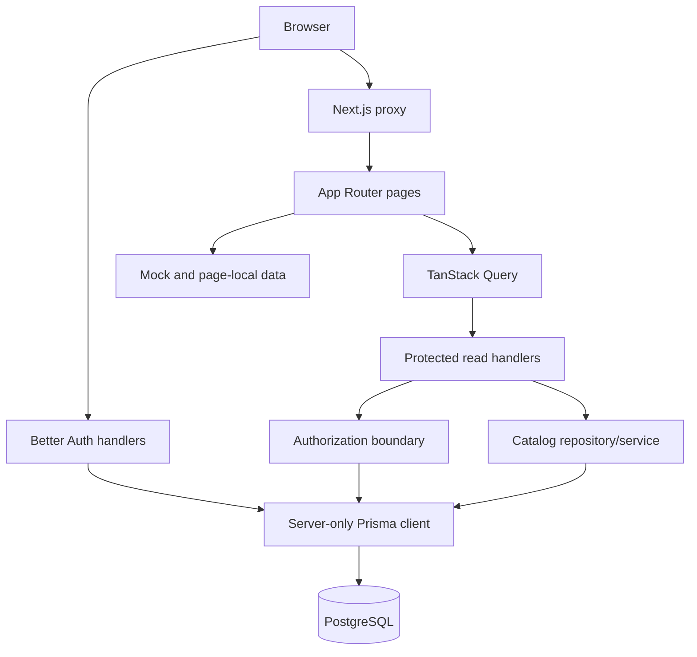

<!-- generated-by: gsd-doc-writer -->
# Architecture

## System overview

Chezcar Sales & Inventory is a Next.js 16 App Router modular monolith. It is still primarily a UI prototype, with one implemented production-oriented foundation slice: database-backed authentication, fixed role/location authorization, and read-only Product/Inventory access through Prisma and PostgreSQL.

Most screens, all business mutations, stock-card history, availability inquiry, reports, notifications, and transaction workflows remain page-local or fixture-backed. Their presence in the UI is not evidence of persistence.

## Active boundaries

## Implemented foundation

| Area | Current behavior | Key files |
| --- | --- | --- |
| Authentication | Better Auth email/password sessions; public sign-up disabled | `lib/server/auth.ts`, `app/api/auth/[...all]/route.ts` |
| Page protection | Database-backed session validation redirects unauthenticated page requests to `/sign-in` | `proxy.ts`, `app/sign-in/` |
| Authorization | Reloads active User and enforces fixed role/location scope in server code | `lib/server/authorization.ts` |
| Persistence | One server-only Prisma singleton and one initial PostgreSQL migration | `lib/server/prisma.ts`, `prisma/migrations/` |
| Products | Validated, paginated Prisma read for Admin and Stock Staff | `app/api/products/route.ts`, `lib/server/catalog.ts`, `app/products/page.tsx` |
| Inventory | Product-first pagination with complete matching balances; Branch Staff forced to assigned Location | `app/api/inventory/route.ts`, `lib/server/catalog.ts`, `app/inventory/page.tsx` |
| Provisioning | Environment-driven Admin plus deterministic reference catalog seed | `prisma/seed.mjs`, `.env.example` |

## Data flow

### Authentication

1. The browser posts email/password to Better Auth's same-origin handler.
2. Better Auth verifies the credential Account and writes a database Session.
3. The browser receives a secure session cookie according to Better Auth environment defaults.
4. `proxy.ts` validates sessions before serving normal page routes.
5. Protected APIs validate the session again, reload the persisted User, require `ACTIVE` status, and enforce role/location policy.

A session identifies a user but does not independently authorize a resource.

### Products

1. `/products` retains applied filter state and a complete TanStack Query key.
2. The browser calls `GET /api/products` with validated pagination/filter parameters.
3. The route permits only Admin or Stock Staff.
4. `lib/server/catalog.ts` queries Product and balance reorder information through Prisma.
5. Decimal values are explicitly serialized for the existing UI DTO.

### Inventory

1. `/inventory` calls `GET /api/inventory` through TanStack Query.
2. The API permits Admin, Stock Staff, and Branch Staff.
3. Branch Staff scope comes from persisted `User.locationId`; request filters cannot widen it.
4. The server filters and paginates Products first, then returns all matching balances for those products.
5. Availability and stock status are derived, not trusted from client input.

Stock card and availability sheets still use local fixtures and must not be described as database-backed.

## App Router composition

- `app/layout.tsx` remains the server root and composes `Providers` with `AppLayoutShell`.
- `AppLayoutShell` omits the sidebar for `/sign-in` and keeps `/pos` as the full-width exception.
- Business pages remain client-heavy because they predate the server foundation.
- New routes should remain server components by default and delegate only interactive islands to clients.
- `proxy.ts` protects page navigation; every sensitive API must still perform its own authorization.

## Database shape

The committed initial schema intentionally includes only models implemented by this slice:

- Location (`WAREHOUSE` or `BRANCH`)
- Product
- InventoryBalance
- User with four fixed roles and optional Location assignment
- Better Auth Session, Account, and Verification

Unimplemented draft order, sale, job, transfer, payment, and movement models are kept out of migration history until their canonical workflow is built. See `docs/product/PROVISIONAL-DATA-MODEL.md`.

## Security properties

- Public sign-up is disabled.
- Seed credentials come only from environment variables and are hashed before storage.
- Prisma and Better Auth stay in server-only modules.
- Product and inventory query parameters are validated with Zod.
- Branch inventory scope is determined by the database, not the browser.
- Inactive users and users without an allowed role are denied by application APIs.
- Existing mock route handlers require active sessions, but they do not yet have final domain-specific authorization policies.

## Known risks

1. Most visible workflows and all mutations remain non-durable prototypes.
2. No automated tests or CI verify authentication, migrations, authorization, or query contracts.
3. The local Compose bind mount can contain machine-specific/corrupt PostgreSQL state; use logical backups and disposable databases for migration verification.
4. Product price is a current Decimal serialized as a number for legacy UI compatibility; canonical price history and money transport are unresolved.
5. Inventory has no immutable movement ledger, transaction service, or concurrency-tested mutation path.
6. Route visibility and the sidebar are not role-aware; server endpoints remain the security boundary.
7. Other page-local product, branch, user, and inventory fixtures still disagree with canonical records.
8. No rate limiting, password reset delivery, controlled user-management workflow, startup environment validation, monitoring, or deployment procedure exists.
9. Lint still fails on broad existing prototype debt, although type-check and build pass.
10. Existing Recharts components emit zero-size warnings during prerender.

## Next direction

1. Add deterministic route and database integration tests for the implemented foundation.
2. Make navigation and page affordances reflect persisted role/location scope without treating visibility as authorization.
3. Define the inventory movement ledger and product import contract before any stock mutation.
4. Implement one transactional workflow at a time behind validated, authorized application services.
5. Add durable notifications and offline behavior only after online transaction invariants are proven.
