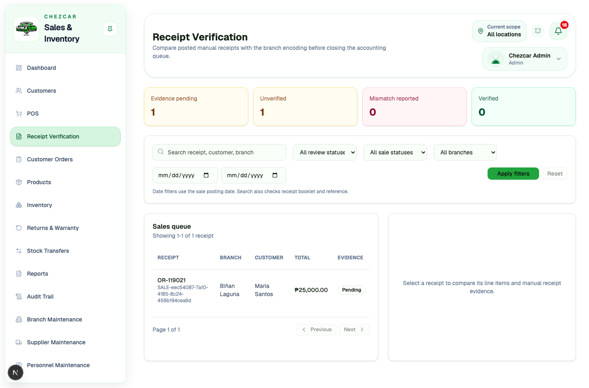
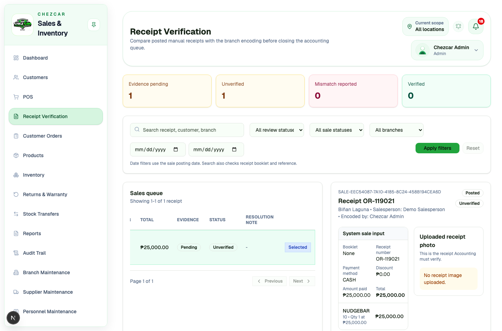
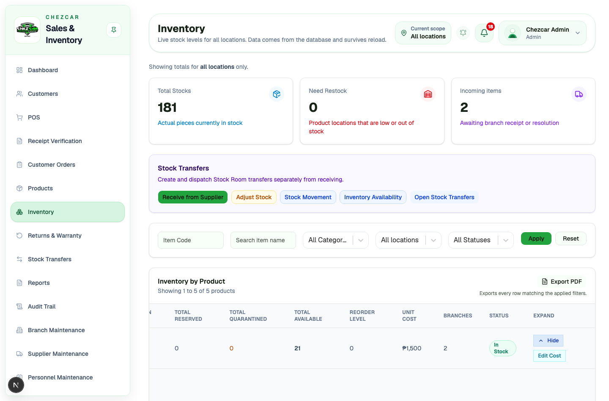
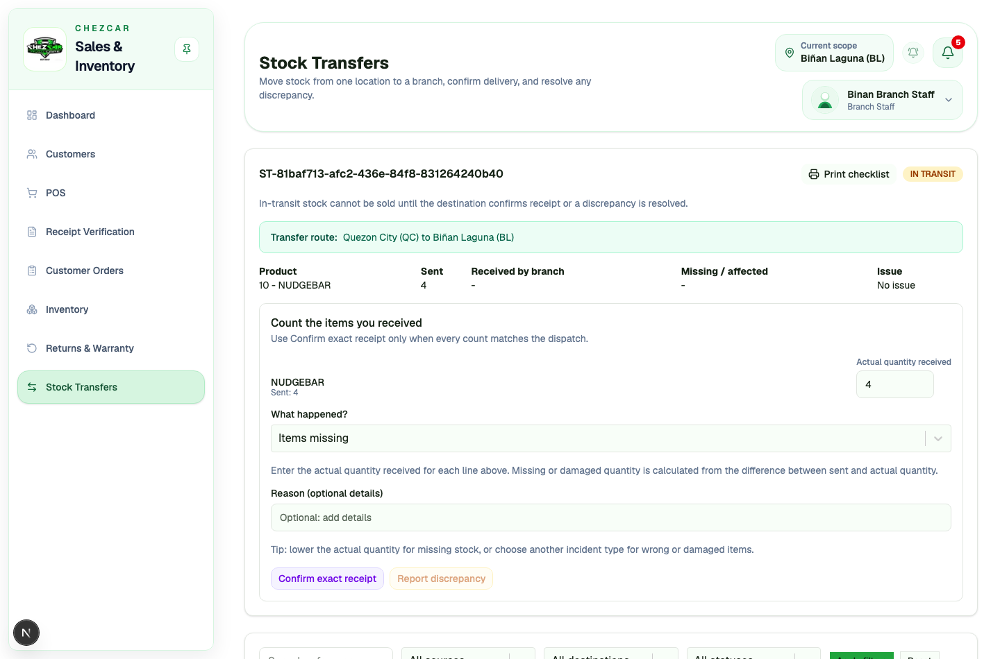
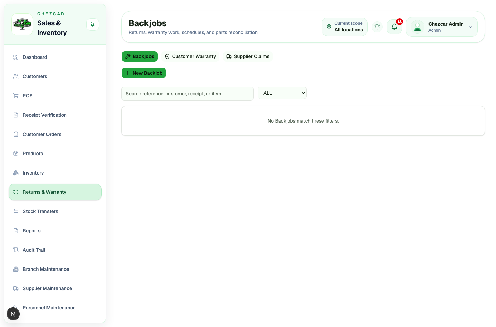
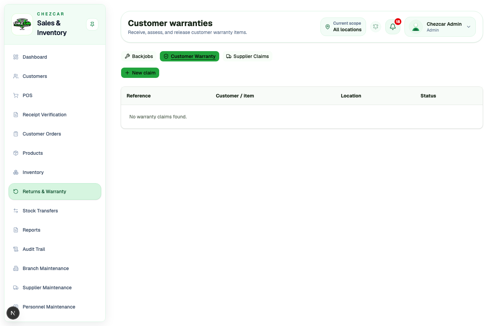
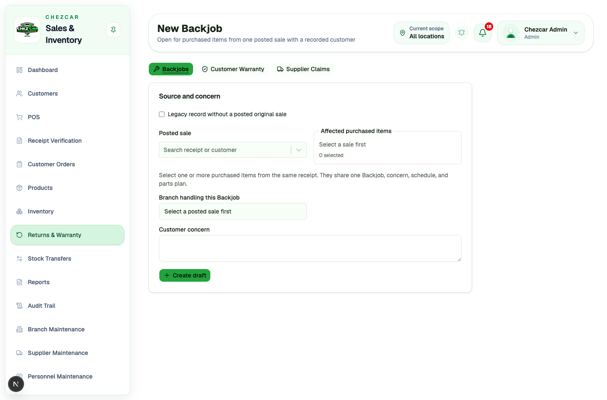
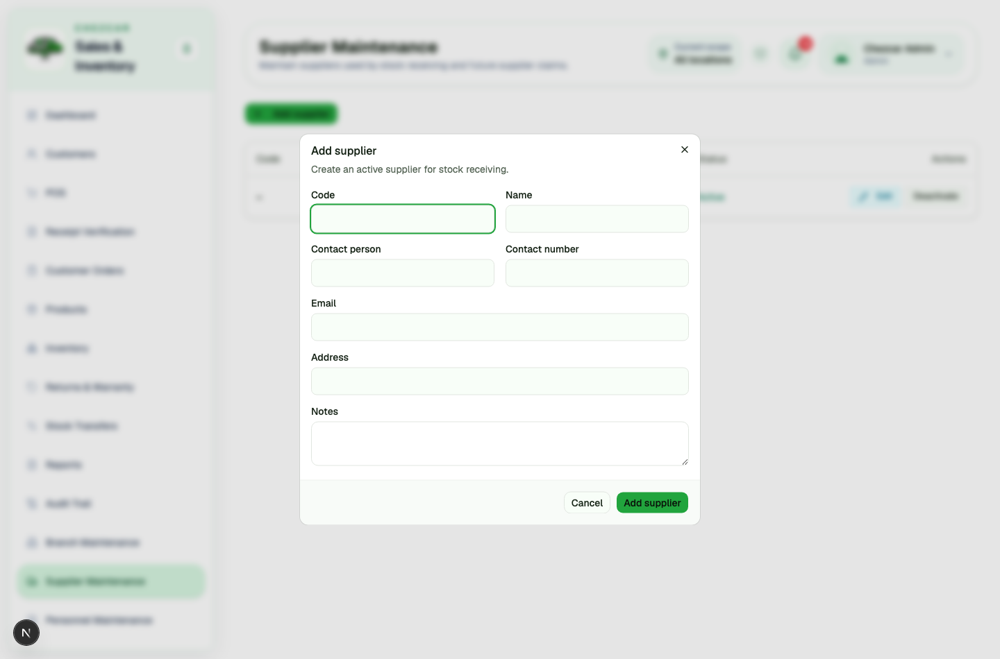
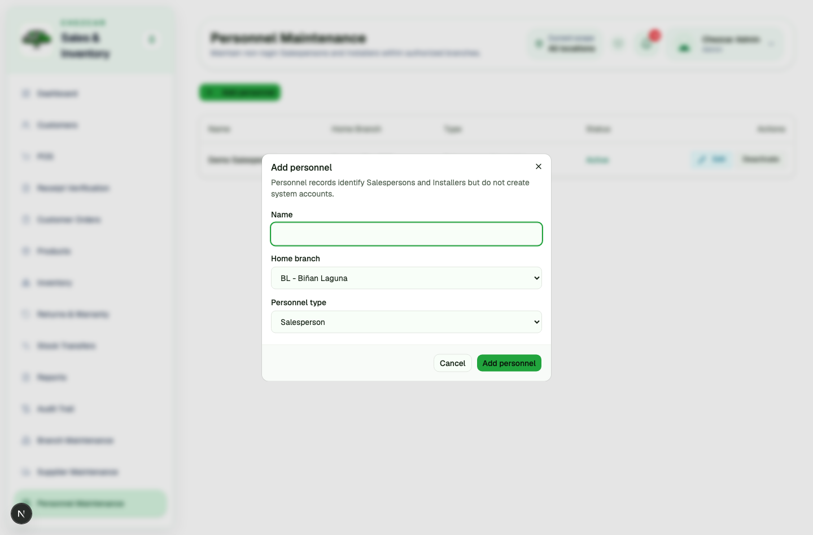

# Sales, Inventory & Monitoring System — User Manual

This manual walks through every screen and transaction in the system. The screenshots come from a real run against a working database, not mockups.

**How access works.** Two things decide what a person can do. Their **role** decides which actions they may perform, and their **assigned locations** decide where. Both must allow an action. A role with "Receive inventory" still cannot receive anywhere unless a branch is assigned to that account.

---

## Contents

1. [Signing in](#1-signing-in)
2. [Dashboard](#2-dashboard)
3. [Customers](#3-customers)
4. [POS: posting a sale](#4-pos-posting-a-sale)
5. [Receipt verification](#5-receipt-verification)
6. [Customer orders](#6-customer-orders)
7. [Products](#7-products)
8. [Inventory](#8-inventory)
9. [Receiving from a supplier](#9-receiving-from-a-supplier)
10. [Stock transfers](#10-stock-transfers)
11. [Returns and warranty](#11-returns-and-warranty)
12. [Reports](#12-reports)
13. [Audit trail](#13-audit-trail)
14. [Branch, supplier and personnel maintenance](#14-branch-supplier-and-personnel-maintenance)
15. [Roles and users](#15-roles-and-users)
16. [Notifications](#16-notifications)

---

## 1. Signing in

Every person signs in with their own account. Shared logins are not allowed, because the system records the name of whoever performed each action.

After signing in, the name and role appear at the top right of every screen. The role shown there explains what the account can and cannot do.

---

## 2. Dashboard

The dashboard summarises the locations assigned to the signed-in account.

- **Available Stock** counts available units across your locations.
- **Supplier Receipts Today** counts deliveries posted today in your locations.
- **Low / Out Stock** lists products at or below their reorder level.
- **Notifications** shows unread alerts for your account.

---

## 3. Customers

Customers are shared across branches. The list shows status, last transaction, branch, and total spend.

**To add a customer**, press **Add Customer**, fill in the name and contact details, then save.

A customer is never deleted. Use **Deactivate** instead: the record stays for history but cannot be picked for new transactions. Reactivate the same way.

---

## 4. POS: posting a sale

POS records a sale that already happened on a handwritten receipt. Posting deducts branch stock immediately, so the entry must match the paper receipt.

**Step 1. Choose the selling branch.** Products and stock come from this branch. You can type to search the branch list.

**Step 2. Find the product.** Search by item code, name, or category.

**Step 3. Add to the cart** and set the quantity.

**Step 4. Complete the sale details.** Customer, salesperson, payment method, the handwritten receipt number, any discount, and optionally a photo of the receipt.

**Step 5. Review and confirm.** The confirmation lists everything before anything is saved.

What the system does on posting: it creates the sale, deducts stock at that branch, records a stock movement, adds the sale to the verification queue, and alerts anyone whose stock has fallen to its reorder level. Stock can never go below zero.

---

## 5. Receipt verification

Every posted sale waits here until someone checks it against the paper receipt.

Open a sale to compare the encoded details with the uploaded photo.

- **Confirm** when the encoded sale matches the receipt.
- **Report a mismatch** when it does not. The branch can then respond, and an authorised user resolves it, keeping the sale or voiding and replacing it.

Posted sales are never deleted. A correction is an auditable void-and-replace.

---

## 6. Customer orders

An order is a booking: a reservation, a reservation with downpayment, or a waiting-stock order.

**Payments.** Record a payment any time before release. Each payment takes an amount and its own receipt number, and the balance updates. The order shows total paid and remaining balance; every payment appears in the audit trail.

**Release.** On release, the final receipt number is recorded, stock is deducted, and the order is completed.

**Cancellation.** An order with a downpayment needs a cancellation note.

---

## 7. Products

The product catalogue holds item codes, names, categories, selling prices, reorder levels, images, and supplier links.

A product with balances or history cannot be deleted; deactivate it instead. Price changes are recorded with the old and new value in the audit trail.

---

## 8. Inventory

Inventory shows stock per location for the branches you are assigned to.

- **Total on hand** is everything physically there, including quarantined units.
- **Available** excludes reserved and quarantined units, and is what POS can sell.
- **Stock Movement** lists every change with its reason and the person responsible.
- **Adjust stock** corrects a count and always requires a reason.

---

## 9. Receiving from a supplier

A delivery is received at the location that physically took it.

**Receive To** is fixed to your branch when you have one, and becomes a choice when you have several. You can only receive into a location assigned to you.

Fill in the receipt reference, supplier, and one line per product: expected, accepted, quarantined, and missing quantities, plus unit cost. Expected must equal accepted plus quarantined plus missing.

What happens on posting:

- Accepted and quarantined units increase on hand; only quarantined units also increase quarantine.
- Missing units change no stock.
- Any quarantined or missing line automatically opens a draft supplier claim.
- Everyone at that location, plus admins, gets a notification that stock arrived.

---

## 10. Stock transfers

A transfer moves stock from one location to a branch. Any location you are assigned to can be the source, and any active branch can be the destination. Source and destination cannot be the same.

**Step 1. Create the draft.** Choose source and destination, then add products and quantities. With one assigned location, the source is filled in for you. Products come from the selected source.

**Step 2. Finalize**, which locks the draft for dispatch.

**Step 3. Dispatch.** Stock leaves the source now, not on arrival. The quantities become in transit and cannot be sold at either end.

**Step 4. The destination counts the delivery.** Only the receiving branch sees these actions.

- **Confirm receipt** when the count matches. Stock lands at the destination and the transfer is complete.
- **Report a discrepancy** when it does not. Nothing moves yet.

**Step 5. Discrepancies.** The source side investigates, then a resolution allocates every missing piece: delivered to the destination, returned to the source, or written off as loss. Stock only moves when the resolution is posted.

**Cancelling** an in-transit transfer returns every in-transit piece to the source. Only the sending side can cancel.

The list can be filtered by reference, source, destination, and status.

---

## 11. Returns and warranty

Three separate case types live here.

- **Backjob**: rework on something already sold, scheduled to an installer, with parts issued and returned.
- **Customer warranty**: a returned item received into quarantine, assessed, then repaired or replaced.
- **Supplier claim**: damaged or missing stock claimed against a supplier, opened automatically from an affected receipt.

Every case keeps its own timeline, and each printable form can be handed to the customer.

---

## 12. Reports

Four read-only reports, each limited to the locations you may see, each exportable to PDF.

- **Sales** covers direct sales and customer orders, filtered by date, branch, salesperson, source, and payment method. Only verified, non-voided sales are counted.
- **Sales by Salesperson** groups the same sales by the personnel recorded at the time.
- **Inventory Summary** shows current available stock per branch.
- **Returns & Warranty** covers cases by date.

Filters stay pending until you press **Apply Filters**.

---

## 13. Audit trail

Admin only. One time-ordered list of everything that happened.

It covers sign-ins, failed sign-ins and sign-outs; master data changes to products, customers, suppliers, personnel, branches, users and roles; sales and corrections; receipt verification; order bookings and payments; every stock movement; transfers at each step; and returns and warranty events.

**View** opens the full detail: who, when, which branch, the items involved, and for transfers, both ends of the route.

Filter by module, date range, or free text.

---

## 14. Branch, supplier and personnel maintenance

Branches can be added at any time. Suppliers and personnel are deactivated rather than deleted, so history stays attributable. Personnel are salespersons and installers, and they do not sign in.

---

## 15. Roles and users

**Roles** decide what an account may do. Permissions are grouped by menu entry and read in sidebar order, so a role is checked the same way it is used.

Two permissions worth knowing: the Stock Transfers group separates sending actions (create, finalize, dispatch, cancel) from receiving actions (receive, report discrepancy). A branch that both sends and receives needs both.

Changing a role's permissions signs out everyone assigned to it.

**Users** hold the account itself: name, email, role, and assigned locations.

A user is deactivated, never deleted, and deactivation ends their sessions immediately.

---

## 16. Notifications

Alerts reach only the people they concern: the branch involved, plus admins and business-wide accounts. Other branches are not disturbed.

Alerts cover stock arrivals, incoming transfers, discrepancies, low stock, and receipt verification work. **Open** jumps to the record behind the alert.

---

## Appendix: rules that never bend

- Stock can never go below zero, online or offline.
- Posted sales and completed transfers are never hard-deleted; corrections are recorded as corrections.
- Users, customers, suppliers, personnel, and used products are deactivated, not deleted, so history keeps its names.
- Every stock change carries a product, quantity, location, reason, person, and time.
- Hiding a button is not security. Every action is checked again on the server.
